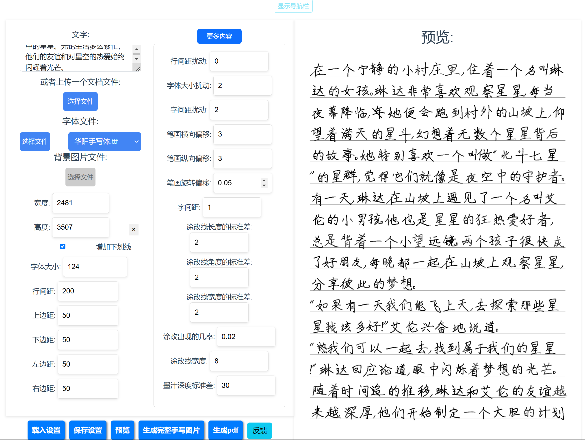

[English](README_en.md) | [中文](README.md)

# 手写文字生成网站

欢迎来到我的手写文字生成网站！这个平台允许你使用现有的字体来创建模拟手写文字的图片。

网址：https://handwrite.14790897.xyz
视频介绍： https://www.bilibili.com/video/BV1DM4y1W7fp/

电报讨论群组：https://t.me/+zFImOziSNullOTE1

## 功能

### 自定义字体

你可以上传自己的字体来生成符合你需求的独特手写风格。

### 背景图片

上传你想要的背景图片，为你的手写文字添加个人风格。如果你没有背景图片，别担心！只需指定图片的宽度和高度，我的网站将自动为你生成带有横线的背景图片。

### 可调参数

你可以完全控制各种参数，如边距（上、下、左、右），字符间的随机扰动，笔画的旋转偏移，墨水的深度变化，涂改痕迹。这使你可以微调你的手写文字的外观。

### 从各种文件类型中提取文本

我的网站可以从各种文件类型中提取文本内容（如 pdf，docs），使你能够方便地上传文本。

### 预览功能

我在网站的右侧添加了预览功能。这使你可以在最终确定之前方便地查看你的手写文字图片的效果。

### 完整图片生成

一旦你对预览满意，你可以生成一整套图片。这些图片将被方便地打包成一个 zip 文件，以便于下载。

### pdf 导出功能

一键生成 pdf，不用再手动粘贴图片

## 自己搭建的方法

克隆项目，在项目目录中使用`docker-compose up -d`，默认端口为 2345

若要添加字体，字体文件放在项目根目录下的 ttf_files 中

### CPU 限制配置

默认配置中对容器进行了 CPU 限制：

- frontend 容器：使用 50%的 CPU
- backend 容器：使用 80%的 CPU

如果不想限制 CPU 使用，可以在 `docker-compose.yml` 文件中删除以下配置：

```yaml
cpu_count: 1
cpu_quota: 50000 # 或 80000
cpu_period: 100000
```

或者可以调整 `cpu_quota` 的值来设置不同的 CPU 使用限制。

## 本地运行

### 环境要求

- **Python 版本**: 3.8 - 3.13（推荐 3.10 或 3.11）
- **Node.js 版本**: 14.x 或更高

### 方法一：使用 VS Code 一键启动（推荐）

1. 克隆项目到本地
2. 使用 VS Code 打开项目文件夹
3. 按 `Ctrl+Shift+B` 快捷键，自动并行启动前端和后端开发服务器
4. 打开浏览器，输入 http://localhost:8080 ，即可访问网站

**其他可用任务**（通过 `Ctrl+Shift+P` → `Tasks: Run Task` 访问）：

- 🔧 安装所有依赖
- 📦 安装前端依赖
- 🐍 安装后端依赖
- 🏗️ 构建前端项目
- 🐳 启动/停止 Docker Compose
- 🧹 清理前端构建

### 方法二：手动启动

1. 克隆项目到本地
2. 进入 backend 文件夹，运行后端程序

```shell
cd backend
pip install -r requirements.txt
python app.py
# 注意：服务将在 5005 端口启动
```

3. 进入 frontend 文件夹，运行前端程序

```shell
cd frontend
npm install
npm run serve
```

4. 打开浏览器，输入 http://localhost:8080 ，即可访问网站

## 结语

我希望你喜欢使用我的手写文字生成网站来创建你的个性化手写文字图片！

## 随笔

2024.6.13 由于昨天需要完成政治论文的手写，于是亲自体验了我的程序，发现效果确实不错，但是几个月来一直没有解决处理大量文字的时候程序没响应的问题，经过我添加日志发现，其实后端一直在生成图片，但是由于 nginx 的超时限制导致请求失败（这个在 docker 的日志中可以看到），于是我修改了外部和镜像内部的 nginx 的超时配置，但是问题仍然存在，这时我发现前端控制台中不再是 504 错误而是 524 错误，经过查询发现这是因为 cf 的超时限制是 100 秒，超过 cf 的限制而报错，解决方法是关闭小黄云不享受 cf 的保护，还有一种解决方法就是让后端不断给前端传输数据保持连接活跃。

## 待做

使用 websocket 保持连接，避免 cf 超时，并通知客户端目前生成进度
socketio.emit('image_generated', {'image_index': i, 'image_path': image_path})
使用队列，通知客户端目前有多少人等待，暂存请求（目前好像是直接抛弃）
