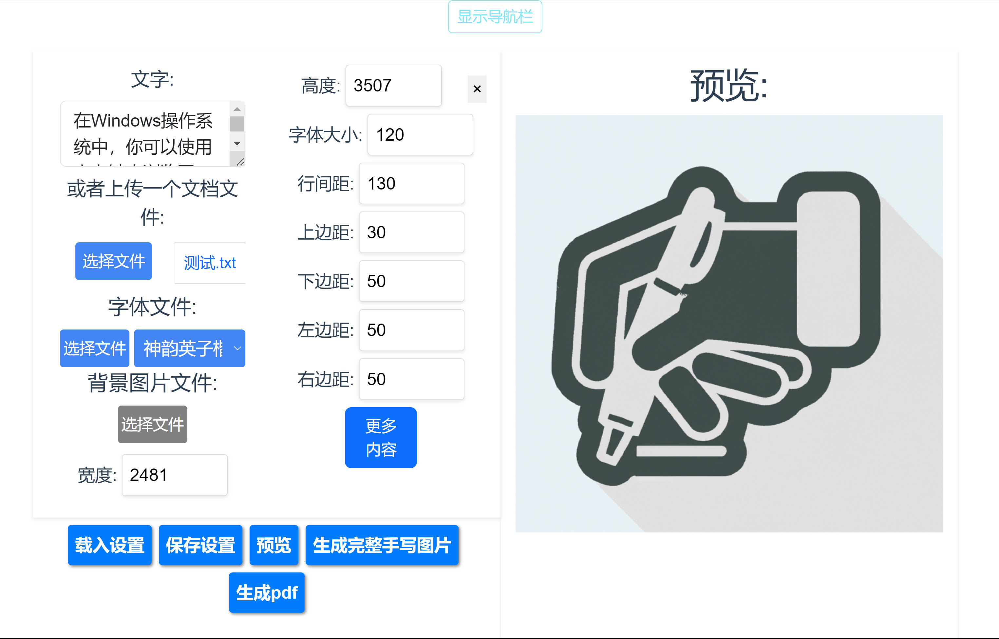

[English](README_en.md) | [中文](README.md)

# 手写文字生成网站

欢迎来到我的手写文字生成网站！这个平台允许你使用现有的字体来创建模拟手写文字的图片。

网址：https://handwrite.liuweiqing.top/

## 功能

### 自定义字体

你可以上传自己的字体来生成符合你需求的独特手写风格。

### 背景图片

上传你想要的背景图片，为你的手写文字添加个人风格。如果你没有背景图片，别担心！只需指定图片的宽度和高度，我的网站将自动为你生成带有横线的背景图片。

### 可调参数

你可以完全控制各种参数，如边距（上、下、左、右），字符间的随机扰动，笔画的旋转偏移，墨水的深度变化，涂改痕迹。这使你可以微调你的手写文字的外观。

### 从各种文件类型中提取文本

我的网站可以从各种文件类型中提取文本内容（如pdf，docs），使你能够方便地上传文本。

### 预览功能

我在网站的右侧添加了预览功能。这使你可以在最终确定之前方便地查看你的手写文字图片的效果。

### 完整图片生成

一旦你对预览满意，你可以生成一整套图片。这些图片将被方便地打包成一个 zip 文件，以便于下载。

### pdf导出功能

一键生成pdf，不用再手动粘贴图片

## 自己搭建的方法

克隆项目，在项目目录中使用`docker-compose up -d`，默认端口为2345

若要添加字体，字体文件放在项目根目录下的ttf_files中

## 结语

我希望你喜欢使用我的手写文字生成网站来创建你的个性化手写文字图片！
