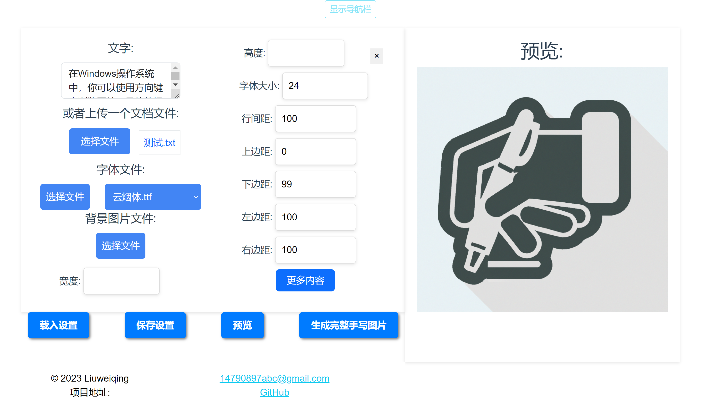

# Handwritten text generation website

Welcome to my handwritten text generation site! This platform allows you to use existing fonts to create images that mimic handwritten text.

URL: https://handwrite.14790897.xyz

## Function

### Custom Fonts

You can upload your own fonts to generate a unique handwriting style that suits your needs.

### Background picture

Upload your desired background image to add a personal touch to your handwriting. If you don't have a background image, don't worry! Just specify the width and height of the picture, and my website will automatically generate a background picture with horizontal lines for you.

### Tunable parameters

You have full control over various parameters such as margins (top, bottom, left, right) and random perturbation between characters. This allows you to fine-tune the look of your handwritten text.

### Extract text from various file types

My site can extract text content from various file types, allowing you to upload text easily.

### Preview function

I added a preview feature to the right side of the website. This allows you to conveniently review how your handwritten text image will look before finalizing it.

### Complete image generation

Once you're happy with the preview, you can generate a full set of images. The images will be conveniently packaged into a zip file for easy download.

## How to build it yourself

Use `docker-compose up -d` in the project directory, the default port is 2345

To add fonts, font files are placed in ttf_files in the project root directory

## Conclusion

I hope you enjoy using my handwriting generator site to create your personalized handwriting pictures!