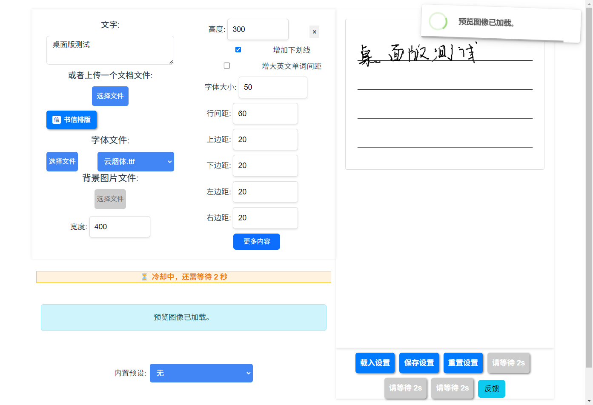

# 桌面版

不想开浏览器、或者想要个能离线跑的本体，可以装桌面版。桌面版把后端和前端打包在一起，
双击就能用，不依赖网络。



## 下载

到 [Releases 页面](https://github.com/14790897/handwriting-web/releases) 找最新的版本，按系统和芯片选：

| 系统 | 文件 |
|---|---|
| Windows | `.exe` 安装包（NSIS），或者免安装的便携版 exe |
| macOS（Apple Silicon） | `.dmg` |

!!! warning "只发 Apple Silicon 的 Mac 包"
    目前只构建 **arm64** 的 macOS 包，Intel Mac 装不了。
    Windows 包不受影响。

## macOS 首次打开被拦住

桌面版**没有做代码签名，也没有公证** —— 仓库里没有 Apple 开发者证书。所以下载后第一次打开，
macOS 会拦下它。在 macOS 15 及以上，提示可能直接说**「文件已损坏」**——
那不是真的损坏，只是系统给下载来的文件打上了隔离属性。

在终端里执行一次：

```shell
xattr -dr com.apple.quarantine /Applications/HandwritingWeb.app
```

或者去「系统设置 → 隐私与安全性」，在提示里点**「仍要打开」**。

## 和在线版有什么不同

功能完全一样，差别只在下面这些：

- **没有 10 页上限** —— 那个限制只加在 `handwrite.14790897.xyz` 上。桌面版是本机跑的，
  受限于你自己机器的性能，想渲染多少页都行。
- **不上报统计** —— 不加载 Google Analytics、Microsoft Clarity、Sentry 和客服插件。
- **不联网下载 pandoc** —— 没有 pandoc 时用 `python-docx` 处理 `.docx`。
- **不受过载保护干扰** —— CPU 占用守卫被放开，本机不至于请求自己都被 429 拦掉。

## 数据放在哪

任务数据库、临时文件、日志和字体都在用户数据目录里，删掉就等于恢复出厂：

| 系统 | 位置 |
|---|---|
| Windows | `%LOCALAPPDATA%\HandwritingWeb` |
| macOS | `~/Library/Application Support/HandwritingWeb` |

里面大致是：

- `tasks.db` —— 任务队列（SQLite）
- `temp/` —— 渲染出来的图片
- `logs/` —— 日志
- 字体

## 自己构建

构建脚本要按**当前平台**跑 —— PyInstaller 不能交叉编译，Windows 包只能在 Windows 上出，
macOS 包只能在对应架构的 Mac 上出。

```shell
bash desktop/build.sh                 # 完整构建：前端 → 后端可执行文件 → 安装包
bash desktop/build.sh --app-only      # 只出 Electron 目录版，不生成安装包
PYTHON=python bash desktop/build.sh   # 指定解释器（CI 用）
```

产物在 `desktop/build/`。开发调试时先 `--app-only`，再在 `desktop/` 下 `npx electron .` 直接跑。

要改桌面版相关代码，先读仓库根的 [`AGENTS.md`](https://github.com/14790897/handwriting-web/blob/main/AGENTS.md) ——
里面写了构建期编码、签名、跨站请求防护这些踩过的坑。
